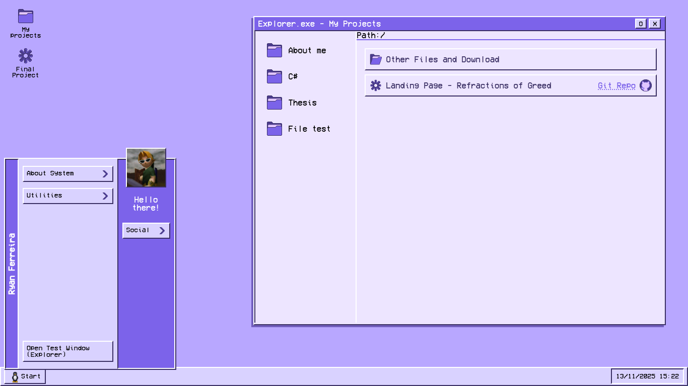

# Interactive Portfolio

Web-based interactive portfolio inspired by the aesthetics of Windows 98/2000, simulating an interactive desktop environment.

Created to organize and present personal projects and experiments. No frameworks, pure HTML, CSS and JavaScript.

## Preview

[Access here!](https://ryanm-ferreira.github.io/)